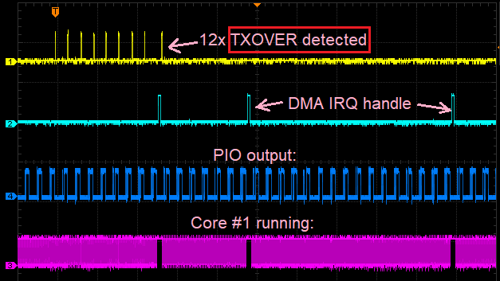

This project demonstrate strange behavior of RP2040 DMA with PIO.

[Discussion on raspberrypi.com forum.](https://forums.raspberrypi.com/viewtopic.php?p=2385377)

Project outline:
1. There is a 32-word buffer from which data must be transferred to the PIO.
2. Two DMA channels are used, each transferring its half of the buffer (16 words) and triggering an interrupt.
3. The DMA interrupt handler runs on core #1. When an interrupt occurs, the handler determines which channel caused it and reinitializes it for transmission.
Problem:
At startup, when DMA + PIO are initiated, the TXOVER flag in the FIFO is set several times (an attempt to write to a full buffer).
I detect this moment programmatically and output 1 to one of the GPIO pins; this is the yellow trace on the oscilloscope. In this project, this only happens once at startup, but in another project, similar behavior is observed when USB is active.

